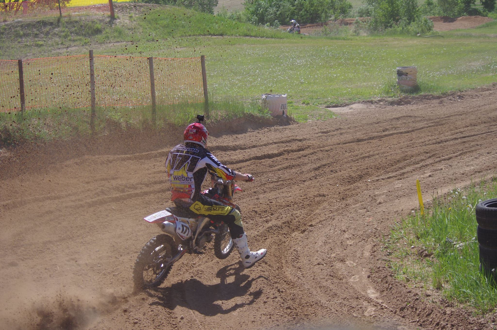

#sabine.ruza
##About me
I'm working as a Development Manager for **3 years**. My main responsibilities includes:
- Technical execution of Document management development activities, lead and supervise the implementation of projects related to document management - local and Baltic projects.
- Coordinate internal Document Management system developments. Identify business needs, collect input and compile business cases for DM system improvements from internal stakeholders. Participate in quality assurance and testing.
- Coordinate e-signing desktop application updates, execute tests, and ensure support for employees about e-signing and e-signature signing tools.
On my free time I like to go for a walk. And as a hobby I'm going to [Latvian motocross championship](https://www.lamsf.lv/) ***as a photographer***.

